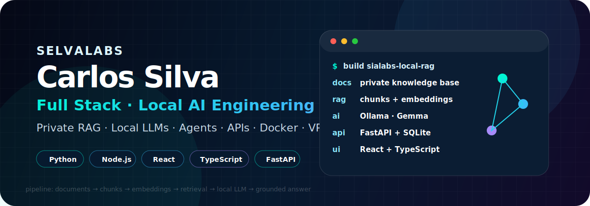

  

# Carlos Selva · SelvaLabs

**Desenvolvedor Full Stack** construindo produtos digitais com **IA aplicada**, **LLMs locais**, **sistemas de agentes**, **APIs**, **integrações**, **infraestrutura** e **documentação técnica**.

Atualmente foco em transformar problemas reais em aplicações completas: do levantamento de requisitos e arquitetura até frontend, backend, banco de dados, automações, deploy, validação local e documentação.

---

## Foco atual

- **Produtos com IA**: RAG, embeddings, LLMs locais e modelos via API.
- **Sistemas locais de IA**: aplicações local-first, privacidade, Ollama, Gemma e execução em ambiente próprio.
- **Sistemas de agentes**: agentes, ferramentas, workflows, integrações, memória, gateways e automações orientadas por IA.
- **Full Stack**: React, TypeScript, Python, Node.js, FastAPI, APIs REST e interfaces para produtos digitais.
- **Dados e infraestrutura**: PostgreSQL, Supabase, SQLite, Docker, Linux, VPS, GitHub Actions e operação de serviços.
- **Documentação técnica**: arquitetura, trade-offs, setup local, validação, limitações, roadmap e runbooks.

---

## Projetos em destaque

### [SoberanIA Labs Local RAG](https://github.com/selvalabs/sialabs-local-rag)

Aplicação **local-first** de Retrieval-Augmented Generation para consulta privada a documentos, usando React, TypeScript, FastAPI, SQLite, Ollama/Gemma, EmbeddingGemma, Docker Compose e validação local.

**Demonstra:** IA aplicada, RAG, LLMs locais, embeddings, busca por similaridade, respostas com fontes, arquitetura full stack, testes e documentação técnica.

---

### [Monitor Comunitário — Celesc Outage Watcher](https://github.com/selvalabs/monitor-comunitario)

Sistema público e independente para acompanhar avisos de desligamentos programados da Celesc e gerar alertas por endereço, com scraper, parser, matching textual, banco de dados, painel admin, worker diário, Docker e CI.

**Demonstra:** backend Python/FastAPI, produto orientado a problema real, automação, scraping, privacidade, banco de dados, operação e documentação.

---

### [Astrology Chart API](https://github.com/selvalabs/astrology-chart-api)

API em FastAPI para cálculo estruturado de mapa astrológico a partir de dados de nascimento, usando Pydantic, Flatlib, Swiss Ephemeris, geocoding, timezone, Docker e testes automatizados.

**Demonstra:** design de API, backend especializado, resposta JSON estruturada, separação de responsabilidades, integração externa, Docker e arquitetura reutilizável.

---

## Stack principal

### Linguagens e frontend

### Backend, APIs e dados

### IA, agentes e infraestrutura

---

## Como eu trabalho

- Começo pelo problema, requisitos e fluxo de uso.
- Estruturo arquitetura, dados, integrações e responsabilidades.
- Desenvolvo frontend, backend, APIs e automações com foco em produto.
- Uso IA tanto como funcionalidade final quanto como parte do processo de desenvolvimento.
- Documento decisões técnicas, trade-offs, setup, validações e próximos passos.
- Busco soluções que sejam úteis, explicáveis, testáveis e preparadas para evolução.

---

## Trilhas em evolução

- **AI Agent Engineering**: padrões para agentes, ferramentas, memória, gateways, observabilidade e deploy.
- **Local AI Systems**: RAG, LLMs locais, privacidade, execução em máquina própria e integração com aplicações.
- **AI Product Engineering**: produtos digitais que incorporam IA de forma útil na arquitetura e na experiência do usuário.
- **ADS e engenharia de software**: documentação de estudos, fundamentos, requisitos, arquitetura e boas práticas.

---

## Contato

- LinkedIn: [Carlos Silva](https://www.linkedin.com/in/carlos-silva-a51a74419/)
- GitHub: [github.com/selvalabs](https://github.com/selvalabs)
